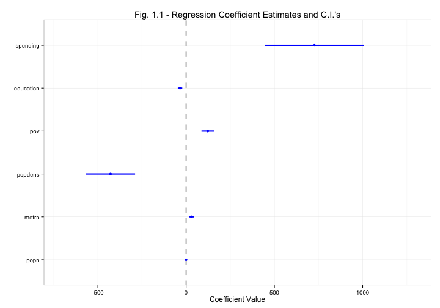
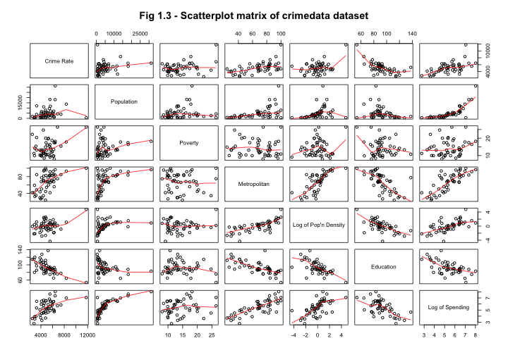

STAT2402 Regression Modelling: Term 2 Coursework
=
Edward Strang
-
***

Continous Dataset (crimedata)
-
The continuous dataset used was the #crimedata# dataset, an abstract of the 1993 US census. There are 51 observations (states) of 7 variables, covering population, population density, metropolitan population, education levels and spending on crime, as well as crime rates. Whilst modelling, I have looked at the relationship between crime rates and the other variables, and tried to see if there is a discernable link between them and crime rates. This analysis could be used to help bring crime rates down. Another application could be to try and predict crime rates in another similar country, but this could be interpolating outside the range of the data, and produce incorrect conclusions. Below is an abstract of the first few lines of the dataset.


```
           Crime  popn  pov metro   popdens education spending
Alabama     4879  4181 17.4  67.4  0.004134     86.10    5.204
Alaska      5568   598  9.1  41.8 -4.313354     93.65    4.905
Arizona     7432  3945 15.4  84.7 -0.864811     77.82    5.844
Arkansas    4811  2426 20.0  44.7 -0.567064    104.70    4.779
California  6457 31217 18.2  96.7  0.890153     83.29    8.023
Colorado    5527  3564  9.9  81.8 -0.870608     89.23    5.583
```


During the fitting of the model, I have considered the real-life relationships between variables to try and fit a model which will best fit the actual data I have. For example, we could hypothesise that in metropolitan areas, there is a higher crime rate, as more people live close proximity. Also, the metropolitan population could influence the total population, as we could postulate that if there is a high number of cities in a state, there is a higher population in that state.

I started off modelling applying a fairly full model, with all the variables in:
$$Y_i = \beta_1 + \beta_2x_{2i} + \beta_3x_{3i} + \beta_4x_{4i} + \beta_5x_{5i} + \beta_6x_{6i} + \beta_7x_{7i} + \epsilon_i$$

where: 
* $x_{2i}$ is the population for the $i^{th}$ state,
* $x_{3i}$ is the log of the population density (mean centered) for the $i^{th}$ state,
* $x_{4i}$ is the metropolitan population for the $i^{th}$ state,
* $x_{5i}$ is the poverty level for the $i^{th}$ state, $x_{2i}$ is the population for the $i^{th}$ state,
* $x_{6i}$ is the education level for the $i^{th}$ state,
* $x_{7i}$ is the log of spending on the department of corrections for the $i^{th}$ state,
* and $\epsilon_i$ is the unobservable error for the $i^{th}$ state.

I checked the model fit using the adjusted $R^2$ statistic. I also looked at the coefplot (Fig. 1.1), which plots each coefficient and it's standard error (as well as twice the standard error). This is also our 95% Confidence Interval for each coefficient. This allows us to remove coefficients from the model which don't appear to have an effect on the crime rate.

 


We can view the adjusted $R^2$ statistic using summary()

```r
summary(crimedata.lm1)
```

```

Call:
lm(formula = Crime ~ popn + metro + popdens + pov + education + 
    spending, data = crimedata)

Residuals:
   Min     1Q Median     3Q    Max 
 -1868   -642   -109    383   3173 

Coefficients:
             Estimate Std. Error t value Pr(>|t|)   
(Intercept) 1153.1136  2163.1834    0.53   0.5967   
popn          -0.1180     0.0409   -2.89   0.0060 **
metro         30.2369    14.1641    2.13   0.0384 * 
popdens     -428.1666   139.0860   -3.08   0.0036 **
pov          122.2276    35.2142    3.47   0.0012 **
education    -34.5371    12.7337   -2.71   0.0095 **
spending     726.6503   280.7794    2.59   0.0130 * 
---
Signif. codes:  0 '***' 0.001 '**' 0.01 '*' 0.05 '.' 0.1 ' ' 1 

Residual standard error: 979 on 44 degrees of freedom
Multiple R-squared: 0.646,	Adjusted R-squared: 0.598 
F-statistic: 13.4 on 6 and 44 DF,  p-value: 1.42e-08 
```


The adjusted $R^2$ for this model is 0.598. The adjusted $R^2$ is a penalised $R^2$ statistic to take into account the number of variables in the model. The $R^2$ statistic is calculated from $$R^2 = \frac{SS_{Model}}{SS_{Total}} \times 100$$
The adjusted $R^2$ takes into account the model terms and is calculated $$Adjusted\hspace{2pt}R^2 = 1-\frac{\hat{\sigma^2}_{Model}}{\hat{\sigma^2}_{Null}}$$
We can use the $R^2$ to compare this model with other models using the same data. We can also use something called the AIC (Akaike's Information Criteron) to compare this model with other models. The AIC is calculated $AIC = -2log(L(\hat{\theta})) + 2p$ ($AIC = nlog(\hat{\theta^2}) + 2p$ for least squares problems.) For this model, the AIC is 855.6401.

When we look at the coefplot for this model, we see that there are a few coefficients which sit on zero, or the confidence intervals cover zero, i.e. the popn (population) variable. We might want to remove this to see if it improves the model fit, and have the model:

$$Y_i = \beta_1 + \beta_2x_{metro,i} + \beta_3x_{popdens,i} + \beta_4x_{pov,i} + \beta_5x_{education,i} + \beta_6x_{spending,i} + \epsilon_i$$


where $Y_i$ is the crime rate for the $i^{th}$ state, and $x_{popdens,i}$ denotes the population density for the $i^{th}$ state (similarly for the other variables/x values). When we look at the coefplot for this model (Fig 1.2) we see that the spending now covers zero. This could suggest we also need to remove the spending variable. For this model, the adjusted $R^2$ is 0.5326 and the AIC value is 862.4793. Compared to the first model, the $R^2$ is lower, and the AIC is higher. At this point, we need to make a judgemental decision whether we are using the $R^2$ or AIC. In this case, I'm using the AIC, as the adjusted $R^2$ can become biased if we 'trawl' for the lowest value.

 


We can also include other types of model parameters, such as interactions, power terms and smooth terms. I have tried adding some interaction terms, to see if they improve the model fit. Looking at the pairs plot (Fig 1.3) to see possible interactions:

 


We can see that there is some correlation between population/metropolitan population and population/population density. I started off by returning to the first complete model, and adding in some interaction terms between the population and metropolitan popn/ population density. Our model then becomes:

$$Y_i = \beta_1 + \beta_2x_{popn,i} + \beta_3x_{metro,i} + \beta_4x_{popdens,i} + \beta_5x_{pov,i} + \beta_6x_{education,i} + \beta_7x_{spending,i} + \beta_{2:3}x_{popn:metro,i} + \beta_{2:4}x_{popn:popdens,i} + \epsilon_i$$


Where $\beta{2:4}$ means the model parameter for the interaction between the 2$^{nd}$ and 4$^{th}$ variable, and $x_{popn:metro,i}$ means the observed reaction between the population and metropolitan population for the $i^{th}$ state (etc.)

This model gives us an improved AIC of 836.4793, a difference of about -26, which is good. However, if we look at the coefplot (Fig 1.4) we still see popn at or close to zero, and it's also pulled metro down.

 


Therefore, we'll remove the popn variable from the model. Because we've removed the popn variable, we also have to remove all the interaction terms associated with it. This returns us to the 2$^{nd}$ model again, so we'll try adding some more interaction terms. From looking at the pairs plot, I think there could be an interaction between:

* Poverty levels and education, as people with less education tend to get lower paid jobs/get jobs at all, and
* Population density and metropolitan population, as there tends to be more people in cities.


I fitted a model with these interaction terms, and its ends up with an AIC of 836.7738. This is better, but if we look at the pairs plot, we also see that spending seems to be influenced by metropolitan population, as well as the population density. Hence, we'll try the model:

$$Y_i = \beta_1 + \beta_2x_{metro,i} + \beta_3x_{popdens,i} + \beta_4x_{pov,i} + \beta_5x_{education,i} + \beta_6x_{spending,i} + \beta_{2:3}x_{metro:popdens,i} + \beta_{4:5}x_{pov:education,i} + \beta_{2:6}x_{spending:metro,i} + \beta_{2:3}x_{spending:popdens,i} + \epsilon_i$$


This model gives us an even better AIC, of 840.3024. This model seems to be the best for the data we have. When we look at the coefplot (Fig 1.5), we see that there are quite large confidence intervals on both spending and population density.

 


This may be because we have taken logs of spending and population density, as the plots of these coefficients seemed to be on an exponential scale (Fig 1.6).

 


If we try returning these to their original value, and refit the model, we get a model with an AIC of 837.5614. When we look at the coefplot (Fig 1.7), we see that all the main variables seem to have an effect, although the confidence interval on poverty is now fairly large. We also see that the interaction between poverty levels and education has an effect on raising crime levels.

 


Compared to the coefficients in the previous model (Fig 1.5), many of the coefficients appear to be close to zero, although it is very important to note the scale on the coefplot. As the data transformations were made for a valid reason, I will use the previous model (with logs of popdens and spending). I think this model best fits and describes the data, so next we need to check that the assumptions used in fitting this model are correct. In fitting the model, we have assumed that the errors are independent, $\epsilon_i$ ~ $Normal(0,\sigma^2)$, with constant variance. We can check the errors are normal by comparing them on a Normal Q-Q plot or by looking at a histogram of the residuals (Both in Fig 1.8). In the Q-Q plot, we are looking for the points to roughly follow the line. We can see that in this case, they do seem to roughly follow the line, although there is some variation from the line. We can also look at the histogram, where we're looking for the histogram to follow the normal line, which it appears to, with a bit of positive skew. Both these plots seem to back up the assumption that our errors are normal.

 


Our other assumption was constant variance, which we can check using a plot of fitted values vs their standardised residuals (Fig 1.9). Standardised residuals are where we subtract the residuals' mean, and then divide by their standard deviation. We can see in this plot there appears to be an equal number of points above and below the line, and there isn't any obvious increase or decrease of residuals across the plot.

 


This proves the assumptions used when fitting this model. We can now look to interpret the model. If we want to look more carefully at the actual value of each parameter, we can look at the coefficients:


```
                  Estimate Std. Error  t value  Pr(>|t|)
(Intercept)      -5280.418   3218.601 -1.64059 1.085e-01
metro               48.570     42.877  1.13277 2.639e-01
popdens           -842.741    684.917 -1.23043 2.255e-01
pov                729.596    162.818  4.48106 5.847e-05
education           56.090     28.200  1.98900 5.340e-02
spending           449.276    628.298  0.71507 4.786e-01
metro:popdens        5.584      5.450  1.02469 3.115e-01
metro:spending      -4.062      8.436 -0.48157 6.327e-01
pov:education       -7.272      1.872 -3.88360 3.673e-04
popdens:spending     6.218    159.301  0.03903 9.691e-01
```


Interestingly, we have a very large negative intercept. This doesn't matter too much though, as this value (-5280.418) would be extrapolating outside the data range, especially as it would be for a near-zero population, which is extremely unlikely and useless for our purposes in finding ways of reducing crime rates.

We see that there is quite a large change in population density and spending to produce a change in the crime rate. This is mainly as we have taken logs of these variables. As the coefficient is -842.7409, this means for a one percent increase in the population density, you get a -8.4695 &times; 10<sup>4</sup> decrease in the crime rate for that state (and vice versa for a decrease in the pop'n density).

Similarly, as the spending variable is also log transformed, the coefficient of 56.0898 means that for a one percent increase in the spending in that state, you get a 5636.9813 increase in the crime rate. However, this is counter-intuitive, as you'd expect the spending to increase _because_ of crime rate, not the crime rate increase because of spending. This variable probably should be ignored, as it is probably dependant on crime rate, not the crime rate dependent on it. I tried re-fitting the model without this variable, but it didn't make a noticeable change in the other variables' coefficients.

When we look at the coefficient for poverty (729.5964), we see that it has quite a large value. This can be interpreted as the crime rate decreases rapidly with a small decrease in the poverty levels of a state. In addition, we see small coefficents for metropolitan population/education (48.5701 and 56.0898 respectively), meaning that a small change in the metropolitan population or education levels corresponds with a small change in the crime rate. This is a positive change, i.e. more education would correspond with more crime, which is interesting, as it isn't what would be expected.

The results of fitting this model suggest that the most effective way of reducing the crime rate would to decrease poverty levels. This could be done by increasing education levels, which could cause an increase in the crime level, but not as big a change as reducing the poverty level would have. This could be interesting to any US state's government committed to decreasing crime levels, as it gives a clear way to decrease the crime rate. It could also be interesting to other countries, as stated above, in helping to decrease crime. However, it should be noted that the data collected was solely for the US, and the crime rates in other countries may have other, different effects on the crime rates.


***
Discrete Dataset (inspol)
-
The discrete dataset used was the #inspol# dataset, from the Sentient Machine Research company. It was obtained from real world business data, and contains information on 2030 customers, and which insurance products they hold. There are 86 variables in the dataset, of which 11 are being used in this analysis. The dependent variable is the amount spent on life insurance policies by a person, and I am regressing it on the income level, education level, age and amount of life insurance policies held. The original dataset contains a number of variables based on socio-economic status and whether they held a range of insurance products. For this regression, we are only interested in life insurance, so have selected the appropriate variables for the sample of the dataset we are using. I have chosen this selection of variables as it allows us to apply regression to see if there is relation between the predictor variables age, education, and income to either number of life insurance policies or amount of life insurance policies held. This could be useful to insurance companies to optimize expense on marketing for example, as they would be able to effectively determine the best target market for their products. One thing to note is that the education and income variables are based on an average for the customer's zipcode.

Because the data we are using is the number of policies held by a person, i.e. count data, I had to use a log-linear model. Therefore, I used the glm() function in R with the poisson family (log link). I started off with a model that covers all the variables in the dataset:

$$log(E[Y_i]) = \beta_1 + \beta_2x_{avg.age,i} + \beta_3x_{ed.low,i} + \beta_4x_{ed.med,i} + \beta_5x_{ed.high,i} + \beta_6x_{inc.lt30k,i} + \beta_7x_{inc.30to45k,i} + \beta_8x_{inc.30to45k,i} + \beta_9x_{inc.45to75k,i} + \beta_{10}x_{inc.75to122k,i} + \beta_{11}x_{inc.mt123k, i} + \beta_{12}x_{lifeins.policiesheld} + \epsilon_i$$


When I fitted this model, I got an AIC of 4449.6227, and coefficients:


```
                             Estimate Std. Error z value  Pr(>|z|)
(Intercept)                  -1.79184    0.87164 -2.0557 3.981e-02
avg.age                      -0.12071    0.04306 -2.8031 5.061e-03
ed.low                       -0.19908    0.08941 -2.2267 2.596e-02
ed.med                       -0.02519    0.09167 -0.2748 7.835e-01
ed.high                      -0.16357    0.08361 -1.9564 5.041e-02
inc.lt30k                     0.01597    0.04414  0.3618 7.175e-01
inc.30to45k                   0.16324    0.04750  3.4364 5.896e-04
inc.45to75k                   0.08766    0.04716  1.8588 6.306e-02
inc.75to122k                  0.10526    0.04429  2.3765 1.748e-02
inc.mt123k                    0.12139    0.06661  1.8224 6.840e-02
lifeins.policiesheld          1.21487    0.42241  2.8761 4.027e-03
ed.low:lifeins.policiesheld   0.06673    0.04637  1.4390 1.502e-01
ed.med:lifeins.policiesheld  -0.10674    0.04650 -2.2953 2.171e-02
ed.high:lifeins.policiesheld  0.20106    0.04007  5.0173 5.241e-07
```


Firstly, we notice there's a large standard error on the average age, and it actually covers zero and a range of positive values with the rule of two estimate. We'll look at that in a bit, but firstly we want to check that the model isn't too overdispersed. We can do this by checking the residual deviance compared to the degrees of freedom (3491.9268 and 5807 respectively). As we can see, the deviance is quite a bit higher than the degrees of freedom. This points to overdispersion, probably as many people in the dataset didn't have a life insurance policy. To compensate for this overdispersion, we can relax the assumption that $\phi$ = 1, and use a quasi-poisson model.


When we use the quasi-poisson model, the confidence intervals/significance levels are changed, as we have smaller standard errors, and therefore larger confidence intervals, due to the changed dispersion parameter. We can see this in the coefficient plots (Fig 2.1) of each model.

 


We can see from this that as the dispersion parameter isn't much more than 1, the confidence interval isn't inflated too much. We now want to check any assumptions made whilst fitting this generalised linear model. There are less assumptions for generalised linear models than for general linear models, but we need to check the data is independent, our residuals have constant variance, and we want to see if the residuals are close to a normal distribution, although this is not too important, as the model is quite robust, and our $\beta$'s will still be valid. For the independence assumption, we can consider the actual data collected. It is data collected from a range of people on their insurance habits, and we can safely assume that they are independent, as they are not going to be influencing each other's insurance choices.

For the constant variance assumption, and the normality assumption, we can look at a plot of deviance residuals vs predicted values and a Q-Q Plot of the deviance residuals (Fig 2.2). In the below dev. resid.'s vs predicted values plot, we can see some interesting patterns, as the data is count data, but we're looking at the homogeneity assumption, which looks at any increase in variance along the length of the plot, such as a funnel or 'megaphone' shape. In this plot, the variance does seem to increase across the plot, although the shape of the plot makes it difficult to draw conclusions, and the model is still quite robust to this assumption.

 


I've also produced a normal Q-Q plot of the deviance residuals, and we can see that whilst some of the residuals follow the line in the middle, the two ends of the plot trail off in different directions. This could be a sign of skew in the distribution of the residuals, which we can see more clearly in a histogram of the residuals (Fig 2.4).

 


We can see that, whilst the middle of the graph is very high, the upper tail of the distribution is stretched out and is larger than the lower tail, which is also stretched out. However, the generalised linear model is quite robust to departures from both the normality and homogeneity assumptions.

I decided to perform regression on this dataset to investigate ways of increasing life insurance sales. This could be done in one of two ways, the first by trying to target areas where life insurance sales aren't the strongest at the moment, or instead focussing on the areas where life insurance sales are the best. If we look at the coefplot for the model I've fitted (Fig 2.5), I can see that the number of life insurance policies held clearly has a positive effect on the amount spent on them. However, I think this should be fairly obvious, as the more policies you have, the more you spend on them.

 


Considering the other regression coefficients, we see that all the income levels (except <$30k) have a positive effect. For example, for a customer with a zipcode average income of >$123k, which has a coefficient of 0.1214, for each increase in household income to >$123k in that area, there is an average 1.1291 factor change in amount spent on life insurance policies. From looking particularly at the income coefficients, it appears that the more affluent neighbourhoods have more insurance policies, as the <$30k income level appears to be around zero. However, if we think about the model fitted, the link is a log-link, so the exponential of the coefficient is the value we are looking at. The exponent of the <$30k income level coefficient is 1.0161, which is slightly less than the other income levels, but not as much as suggested in the coefplot. Although this is true, I'm less sure about this coefficient, as it's standard error bars cross zero (although as I've fitted a quasi-poisson these are increased).

Looking at the education levels, they all seem to have a negative effect on the amount spent on insurance policies, with the exception of medium education. This could be because at this level of education, you are aware that a life insurance policy is a good idea, but perhaps not smart enough to get the best deal on a policy, so be paying more than someone with a higher level of education.

Finally, the average age also seems to have a negative effect, which could be explained by older people not taking up as many insurance policies, or being refused more, which would mean they spend less on them.

In conclusion, from the model fitted to this dataset, the best way to ensure more revenue from life insurance sales would be to either target the low income households, as they don't currently take up policies as much, or medium education, such as 6th Form/college (or equivalent) graduates. If the insurance company wanted to increase revenue by targeting already profitable markets, they could target mid to high income households, as they will tend to have more insurance policies, and will spend more on them.

***

### Bibliography
  
_crimedata_ dataset:

Data: U.S. Federal Bureau of Investigation, _Crime in the United States_
      U.S. National Center for Education Studies, _Digest of Education Statistics_
      __via__ Statistical Abstract of the United States Census, 1993 & 1995
      http://www.census.gov/prod/www/abs/statab1995_2000.html
      
_lifeins_ dataset:

Abstract of P. van der Putten and M. van Someren (eds). CoIL Challenge 2000: The Insurance Company Case.
Published by Sentient Machine Research, Amsterdam.
Also a Leiden Institute of Advanced Computer Science Technical Report 2000-09. June 22, 2000.
