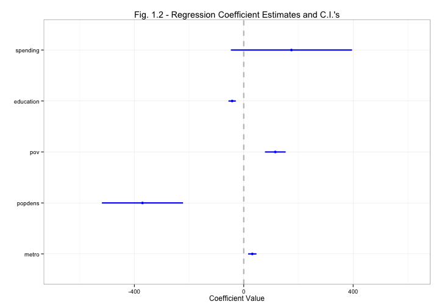
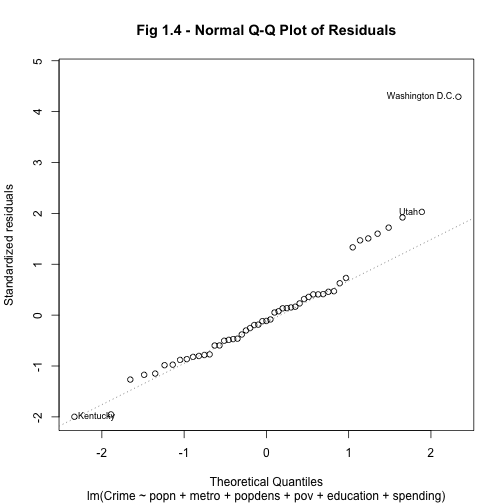

STAT2402 Regression Modelling: Term 2 Coursework
=
Edward Strang
-
***

Continous Dataset (crimedata)
-
The continuous dataset used was the #crimedata# dataset, an abstract of the 1993 US census. There are 51 observations (states) of 7 variables, covering population, population density, metropolitan population, education levels and spending on crime, as well as crime rates. Whilst modelling, I have looked at the relationship between crime rates and the other variables, and tried to see if there is a discernable link between them and crime rates. This analysis could be used to help bring crime rates down. Another application could be to try and predict crime rates in another similar country, but this could be interpolating outside the range of the data, and produce incorrect conclusions. Below is an abstract of the first few lines of the dataset.


```
  Crime  popn  pov metro   popdens education spending
1  4879  4181 17.4  67.4  0.004134     86.10    5.204
2  5568   598  9.1  41.8 -4.313354     93.65    4.905
3  7432  3945 15.4  84.7 -0.864811     77.82    5.844
4  4811  2426 20.0  44.7 -0.567064    104.70    4.779
5  6457 31217 18.2  96.7  0.890153     83.29    8.023
6  5527  3564  9.9  81.8 -0.870608     89.23    5.583
```


During the fitting of the model, I have considered the real-life relationships between variables to try and fit a model which will best fit the actual data I have. For example, we could hypothesise that in metropolitan areas, there is a higher crime rate, as more people live close proximity. Also, the metropolitan population could influence the total population, as we could postulate that if there is a high number of cities in a state, there is a higher population in that state.

I started off modelling applying a fairly full model, with all the variables in:
$$Y_i = \beta_1 + \beta_2x_{2i} + \beta_3x_{3i} + \beta_4x_{4i} + \beta_5x_{5i} + \beta_6x_{6i} + \beta_7x_{7i} + \epsilon_i$$

where: 
* $x_{2i}$ is the population for the $i^{th}$ state,
* $x_{3i}$ is the log of the population density (mean centered) for the $i*^{th}$ state,
* $x_{4i}$ is the metropolitan population for the $i^{th}$ state,
* $x_{5i}$ is the poverty level for the $i*^{th}$ state,* $x_{2i}$ is the population for the $i^{th}$ state,
* $x_{6i}$ is the education level for the $i*^{th}$ state,
* $x_{7i}$ is the log of spending on the department of corrections for the $i^{th}$ state,
* and $\epsilon_i$ is the unobservable error for the $i^{th}$ state.

I checked the model fit using the adjusted $R^2$ statistic. I also looked at the coefplot (Fig. 1.1), which plots each coefficient and it's standard error (as well as twice the standard error). This is also our 95% Confidence Interval for each coefficient. This allows us to remove coefficients from the model which don't appear to have an effect on the crime rate.

 


We can view the adjusted $R^2$ statistic using summary()

```r
summary(crimedata.lm1)
```

```
## 
## Call:
## lm(formula = Crime ~ popn + metro + popdens + pov + education + 
##     spending, data = crimedata)
## 
## Residuals:
##    Min     1Q Median     3Q    Max 
##  -1868   -642   -109    383   3173 
## 
## Coefficients:
##              Estimate Std. Error t value Pr(>|t|)   
## (Intercept) 1153.1136  2163.1834    0.53   0.5967   
## popn          -0.1180     0.0409   -2.89   0.0060 **
## metro         30.2369    14.1641    2.13   0.0384 * 
## popdens     -428.1666   139.0860   -3.08   0.0036 **
## pov          122.2276    35.2142    3.47   0.0012 **
## education    -34.5371    12.7337   -2.71   0.0095 **
## spending     726.6503   280.7794    2.59   0.0130 * 
## ---
## Signif. codes:  0 '***' 0.001 '**' 0.01 '*' 0.05 '.' 0.1 ' ' 1 
## 
## Residual standard error: 979 on 44 degrees of freedom
## Multiple R-squared: 0.646,	Adjusted R-squared: 0.598 
## F-statistic: 13.4 on 6 and 44 DF,  p-value: 1.42e-08
```


The adjusted $R^2$ for this model is 0.598. The adjusted $R^2$ is a penalised $R^2$ statistic to take into account the number of variables in the model. The $R^2$ statistic is calculated from $$R^2 = \frac{SS_{Model}}{SS_{Total}} \times 100$$
The adjusted $R^2$ takes into account the model terms and is calculated $$Adjusted\hspace{2pt}R^2 = 1-\frac{\hat{\sigma^2}_{Model}}{\hat{\sigma^2}_{Null}}$$
We can use the $R^2$ to compare this model with other models using the same data. We can also use something called the AIC (Akaike's Information Criteron) to compare this model with other models. The AIC is calculated $AIC = -2log(L(\hat{\theta})) + 2p$ ($AIC = nlog(\hat{\theta^2}) + 2p$ for least squares problems.) For this model, the AIC is 855.6401.

When we look at the coefplot for this model, we see that there are a few coefficients which sit on zero, or the confidence intervals cover zero, i.e. the popn (population) variable. We might want to remove this to see if it improves the model fit, and have the model:

$$Y_i = \beta_1 + \beta_2x_{metro,i} + \beta_3x_{popdens,i} + \beta_4x_{pov,i} + \beta_5x_{education,i} + \beta_6x_{spending,i} + \epsilon_i$$


where $Y_i$ is the crime rate for the $i^{th}$ state, and $x_{popdens,i}$ denotes the population density for the $i^{th}$ state (similarly for the other variables/x values). When we look at the coefplot for this model (Fig 1.2) we see that the spending now covers zero. This could suggest we also need to remove the spending variable. For this model, the adjusted $R^2$ is 0.5326 and the AIC value is 862.4793. Compared to the first model, the $R^2$ is lower, and the AIC is higher. At this point, we need to make a judgemental decision whether we are using the $R^2$ or AIC. In this case, I'm using the AIC, as the adjusted $R^2$ can become biased if we 'trawl' for the lowest value.

 


I've also tried removing the spending variable, to see if it affects the model fit. The coefplot (Fig 1.3) shows that now none of the variables cover zero. However, the AIC for this model is also higher, suggesting that the original model still describes the dataset best. Hence, I am using the model

$$Y_i = \beta_1 + \beta_2x_{popn,i} + \beta_3x_{metro,i} + \beta_4x_{popdens,i} + \beta_5x_{pov,i} + \beta_6x_{education,i} + \beta_7x_{spending,i} + \epsilon_i$$

I have looked at including interaction terms, smooth terms or power terms, but trying these terms increases the AIC and makes the model more difficult to interpret properly.

 


Looking at the model we have fitted, we see some interesting results, interpreted in more detail later on in this report. We first want to check that the assumptions used in fitting this model are correct. In fitting the model, we have assumed that the errors are 


 


***
Discrete Dataset (inspol)
-
